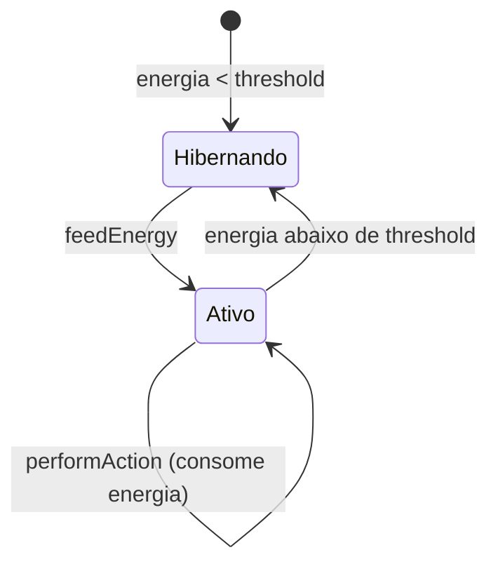

# Arquitetura Helios (v0.1)

## Visão Geral
Helios combina três camadas principais:

1. **Camada on-chain (NFT + energia)**
   - Contrato `ThermodynamicAgent` representa identidade persistente de cada agente.
   - Energia acumulada define se o agente está ativo ou hibernando.
2. **Camada off-chain (executor/autonomia)**
   - Processo Python monitora estado energético e executa ações.
   - Interações com LLM e memória podem ser integradas gradualmente.
3. **Camada de observabilidade/documentação**
   - Whitepaper, métricas de SPJ e logs para evolução do protocolo.

## Diagrama Conceitual
```mermaid
flowchart LR
    A[Agente Off-chain\nPython] -->|feedEnergy| B[ThermodynamicAgent.sol]
    A -->|performAction| B
    B -->|getAgentStatus| A
    A --> C[(Memória/Logs Off-chain)]
    A --> D[LLM Provider\n(opcional)]
```

## Ciclo Termodinâmico Simplificado


## Decisões de Projeto (v0.1)
- Energia é virtual (inteiro simples) para acelerar prototipagem.
- `performAction` apenas emite evento (sem execução arbitrária on-chain).
- Segurança inicial baseada em ownership do NFT.

## Evoluções Planejadas
- Prova de energia real (PoE) como fonte de crédito energético.
- Mecanismo de fronteira energética multiagente.
- Registro imutável de memória semântica (hashes on-chain + payload off-chain).
